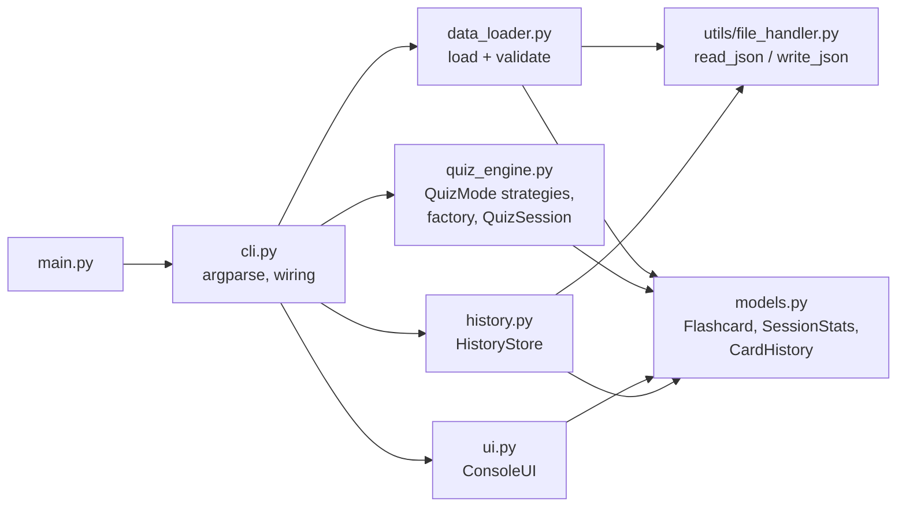

# Flashcard Quizzer

A command-line quiz tool that helps new hires memorize terms such as server
acronyms. It loads flashcards from a JSON file, asks them in the terminal,
gives immediate colored feedback, and ends with a summary of the session.

Built with AI assistance (Claude Code) as part of the Udacity project
*AI-Assisted Development*. The prompts are in [prompts.md](prompts.md), and the
review of the generated code is documented in
[docs/ai_edit_log.md](docs/ai_edit_log.md).

## Features

- **Two JSON layouts**: a plain array `[{"front": ..., "back": ...}]` or an
  object `{"cards": [...]}`.
- **Validation with friendly errors**: a missing file, broken JSON or a card
  without `"back"` ends the program with a one-line message, never a traceback.
- **Three quiz modes** (Strategy pattern):
  - `sequential`: cards 1 to N in file order
  - `random`: shuffled (`--seed` makes the order repeatable)
  - `adaptive`: cards you missed in earlier sessions come first, then new
    cards, then cards you already know. A card you miss during the quiz is
    asked again two questions later (at most twice more).
- **Case-insensitive answers**: extra spaces are ignored too.
- **Session summary**: total questions, accuracy % and the list of missed terms.
- **Persistent history**: results are stored between sessions
  (`~/.flashcard_quizzer/history.json`); `--stats` shows them per card.
- **Export**: `--export summary.json` saves the session summary.
- **Colors**: green for correct, red for incorrect. Disable with `--no-color`
  or the `NO_COLOR` environment variable.
- **Quit anytime**: type `exit` (or `quit`) or press Ctrl+C. The summary is
  still shown.

## Setup

Requires **Python 3.10 or newer** and pip.

```bash
# macOS / Linux
python3 -m venv venv
source venv/bin/activate
pip install -r requirements.txt
```

```powershell
# Windows (PowerShell)
python -m venv venv
venv\Scripts\activate
pip install -r requirements.txt
```

The only runtime dependency is `colorama` (colors on Windows terminals). The
rest of `requirements.txt` holds the test and code-quality tools.

## Usage

```bash
python main.py --help                                    # list all flags
python main.py --mode sequential --file data/glossary.json
python main.py -m adaptive -f data/python_basics.json
python main.py -m random -f data/glossary.json -n 5 --seed 42
python main.py -f data/glossary.json --stats             # all-time results
python main.py -f data/glossary.json --export summary.json
```

| Flag | Description |
|---|---|
| `-f`, `--file PATH` | JSON deck to load (required) |
| `-m`, `--mode MODE` | `sequential` (default), `random` or `adaptive` |
| `-n`, `--limit N` | stop after N questions |
| `--stats` | show all-time statistics for the deck instead of a quiz |
| `--export PATH` | save the session summary as JSON |
| `--history-file PATH` | where results are stored between sessions |
| `--seed N` | repeatable order in random mode |
| `--no-color` | plain output without colors |

### Example session

```text
$ python main.py -m sequential -f data/glossary.json -n 3
Flashcard Quizzer
Deck: glossary.json (10 cards) | Mode: sequential
Type your answer and press Enter. Type 'exit' or press Ctrl+C to quit.

Q1: DNS
> domain name system
Correct!

Q2: HTTP
> hypertext protocol
Incorrect. Answer: Hypertext Transfer Protocol

Q3: SSH
> secure shell
Correct!

Session Summary
+-----------------+-------+
| Metric          | Value |
+-----------------+-------+
| Total Questions | 3     |
| Correct         | 2     |
| Accuracy        | 66.7% |
+-----------------+-------+
Missed terms:
  - HTTP -> Hypertext Transfer Protocol
```

### Deck format

```json
[
  {"front": "DNS", "back": "Domain Name System"},
  {"front": "SSH", "back": "Secure Shell"}
]
```

or

```json
{"cards": [{"front": "Keyword that defines a function", "back": "def"}]}
```

`front` and `back` must be non-empty text. Other fields are ignored. Two
sample decks are included: `data/glossary.json` (array layout, server
acronyms) and `data/python_basics.json` (object layout).

## Architecture



| Module | Responsibility |
|---|---|
| `main.py` | Entry point; calls `cli.main()` |
| `cli.py` | Parses flags, connects the components, runs the question loop |
| `data_loader.py` | Validates both JSON layouts and builds `Flashcard` objects |
| `quiz_engine.py` | `QuizMode` base class, `SequentialMode`, `RandomMode`, `AdaptiveMode`, the `create_quiz_mode` factory, and `QuizSession` (scoring, no I/O) |
| `ui.py` | All terminal input/output: prompts, colors, tables |
| `history.py` | Stores per-card results between sessions |
| `models.py` | Data classes shared by all modules |
| `utils/file_handler.py` | JSON read/write with readable errors and atomic writes |

**Design patterns**

- **Strategy**: `QuizMode` defines `next_card()` and `record_result()`. Each
  mode is one algorithm for picking the next card. `QuizSession` only knows
  the interface, so a new mode such as spaced repetition is a new class plus
  one line in the factory.
- **Factory**: `create_quiz_mode(name, cards, ...)` turns the `--mode` flag
  into the right strategy object and passes each mode only what it needs.

## Testing and code quality

```bash
python -m pytest tests/                          # 91 tests
python -m pytest --cov=. --cov-report=html       # coverage report in htmlcov/
black --check . && isort --check-only . && flake8 . && mypy .
```

Current results: all 91 tests pass, **99 % coverage**
(see [docs/coverage_report.txt](docs/coverage_report.txt)), and black, isort,
flake8 and mypy (`strict` mode) report no issues.

| Test file | What it covers |
|---|---|
| `test_flashcard_loader.py` | both JSON layouts, invalid JSON, missing fields, 12 malformed structures |
| `test_quiz_modes.py` | factory, order of each mode, adaptive repeats and history ordering, session limit, answer matching |
| `test_integration.py` | full CLI sessions with a simulated user: 3-question session with stats and export, `exit`, Ctrl+C, errors, history across sessions, `--stats`, colors |
| `test_history.py` | persisting results, separate decks, corrupt history files |
| `test_file_handler.py` | JSON read/write errors, atomic writes |
| `test_models.py`, `test_ui.py` | statistics calculation and output formatting |

## Project documents

- [prompts.md](prompts.md): prompts used to build the application
- [docs/ai_edit_log.md](docs/ai_edit_log.md): review findings and corrections of the AI-generated code
- [docs/final_report.md](docs/final_report.md): final project report
- [docs/coverage_report.txt](docs/coverage_report.txt): coverage report
